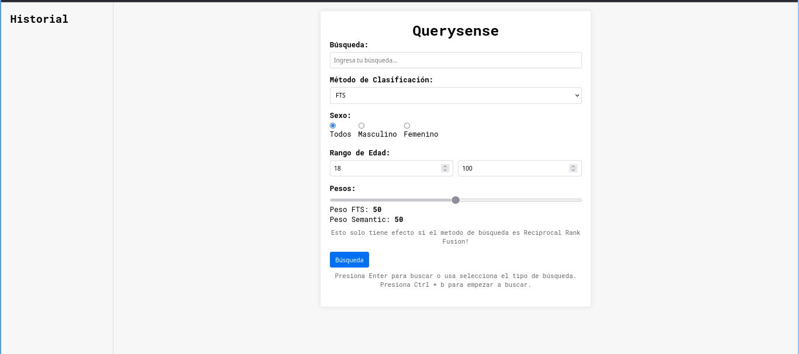

---

<div align = "center">

# QuerySense 🔍

<a href=https://github.com/lauacosta/querysense/actions/workflows/general.yaml>
    
</a>

Querysense es una herramienta para búsquedas exactas, semánticas e híbridas sobre datos almacenados en una base de datos SQL.




</div>

---

## Acerca de
Herramienta interna de [TNEA - Red Social Profesional del Nordeste Argentino](https://tnea.ar/) para búsquedas híbridas sobre datos.

## Features
El proyecto utiliza las extensiones de sqlite [fts5](https://sqlite.org/fts5.html) y [sqlite-vec](https://github.com/asg017/sqlite-vec).

- Búsqueda Exacta: Realizar búsquedas estrictas de acuerdo al query.
- Búsqueda Semántica: Indentifica datoso similares usando modelos de IA.
- Búsqueda Híbrida: Diferentes combinaciones de búsqueda exacta y semántica:
    - Re-rank by Semantics: Realiza una búsqueda exacta y los re-ordena de acuerdo a su distancia vectorial con respecto al query.
    - Reciprocal Rank Fusion: Valora los resultados obtenidos por ambos métodos por sobre los demás.
    - Keyword First: Devuelve los resultados exactos primeros y luego los semánticos.
- Diseñado específicamente para bases de datos SQL.

Para tener una idea de cúal método usar de acuerdo al caso, es interesante y recomiendo leer el blog original de [Alex Garcia](https://alexgarcia.xyz/blog/2024/sqlite-vec-hybrid-search/index.html#which-should-i-choose), el cual sirvió como base del proyecto.

> [!WARNING]
> Este proyecto se encuentra en desarrollo y no está terminado. Puede contener bugs o funcionalidades incompletas.

## Instalación desde el código fuente
> [!IMPORTANT]
> Para compilar la aplicación asegurate de tener un compilador de rust instalado desde la versión +1.78.0 .

```
git clone https://github.com/lauacosta/querysense.git
cd querysense

cargo build --release
```

## Uso


